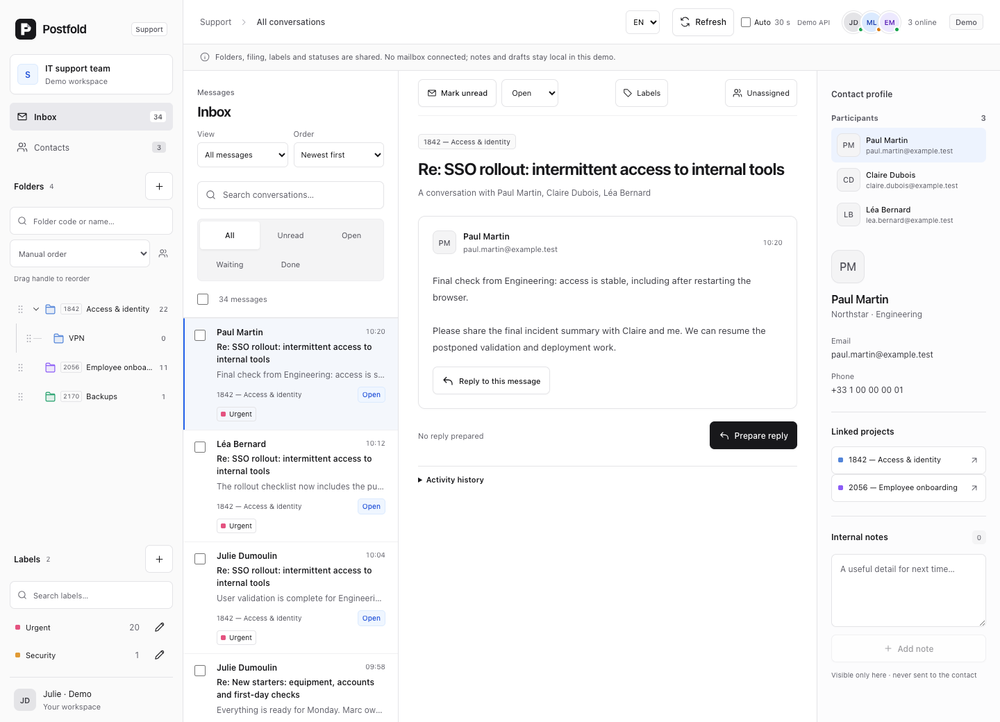

# Postfold

**An open-source shared support inbox, organized around your projects.**

A familiar email interface with project folders, conversation tracking and contact context. Built with **TanStack Start, React, NestJS and PostgreSQL**.



## Highlights

- Shared folder trees, colors, drag-and-drop ordering and sorting.
- Shared labels: create, edit, filter and assign individually or in batches.
- All-message or threaded conversation view, with direct reply controls.
- Read/unread and workflow states, individually or in batches.
- First-gesture drag-and-drop and batch actions that keep the list stable.
- Contacts, conversation history, notes and saved drafts.
- French/English interface, IT support demo, search and automatic refresh.

See the [feature gallery and technical guide](docs/guide.md) for screenshots and details.

## Run locally

Requires Node.js 24+, pnpm 10 and Docker Compose.

```sh
pnpm install --frozen-lockfile
pnpm dev
```

Open **http://127.0.0.1:3002**. PostgreSQL and the separate API start automatically.

**Early demo:** fictional IT support data, French/English interface, no connected mailbox or authentication. Sending is disabled and presence is simulated. Notes and drafts are still browser-local. IMAP/SMTP, SSO and offline sync are planned.

## Development

```sh
pnpm typecheck
pnpm test
pnpm build
```

With the dev server running and `agent-browser` installed, `pnpm test:drag` checks native drag-and-drop and list stability.

[Contributing](CONTRIBUTING.md) · [Technical guide](docs/guide.md) · [Self-hosting](docs/self-hosting.md) · [AGPL-3.0-only license](LICENSE)
