# Postfold

**An open-source shared support inbox, organized around your projects.**

Postfold brings project folders, conversation tracking and contact context into a familiar email interface. It is built with TanStack Start, React, a separate NestJS API and PostgreSQL, with optional native IMAP/SMTP connectivity.

**Status: early development, with an optional live IMAP/SMTP mode.** The default demo has fictional messages/contacts, disabled sending and no authentication. [Configure a real mailbox](mailbox-setup.md) to enable encrypted credentials, authenticated access, IMAP synchronization and SMTP text replies. Switch between French and English using the header selector. The locale is stored in the URL (`?lang=fr` or `?lang=en`) and applies during server rendering. Messages, custom folder names and labels are never translated. The fictional requests cover VPN access, MFA reset, onboarding and backup recovery.


## Feature highlights

| Feature | Available today |
| --- | --- |
| Project folders | `ID - Project name` at the root; named subfolders, creation, editing, deletion of empty folders without children, preset/custom colors, descendant counts, search, manual ordering and six sort modes. Folder settings are shared in PostgreSQL. |
| Conversation tracking | Read on opening; manual read/unread; independent Open, Waiting and Closed states; individual and atomic batch updates. States are shared in PostgreSQL. |
| Assignment and activity | Assign to yourself or a known teammate, remove assignments, apply in batches and inspect the latest 50 recorded actions. Keycloak identities supply verified authors; concurrent writes use revision checks. |
| Display modes | All messages with direct reply controls, or threads with counts and expandable messages. Grouping uses explicit thread IDs; display preference stays browser-local. |
| Selection and filing | Checkboxes, range selection, select all, first-gesture drag-and-drop, a drag preview with a count badge, highlighted drop targets and a searchable destination picker. Filing uses revision checks and moves native IMAP messages in live mode. |
| Labels | Shared creation, renaming, colors, ordering, deletion, search, filtering and single/batch assignment. Deleting a label removes it from every conversation in one transaction. |
| Contacts | Contact details, associated projects, conversation history and browser-local notes. |
| Drafts | Save and Send controls together; local draft persistence and save on conversation change. Send stays disabled until a mailbox is connected. |
| Refresh | Manual refresh and automatic refresh every 30 seconds while visible and online. Live mode synchronizes IMAP; demo mode refreshes fictional API data. |
| Interface | Responsive layout, keyboard controls and a compact folder tree, French/English controls and a header with simulated team presence. No real presence synchronization yet. |

### Batch actions without moving the list

Select messages or threads, then open **Actions** to change read or workflow states or search for a destination project. The panel overlays the list, so selection does not push messages down. Escape closes the destination suggestions first, then the actions panel; a click outside also closes the panel.

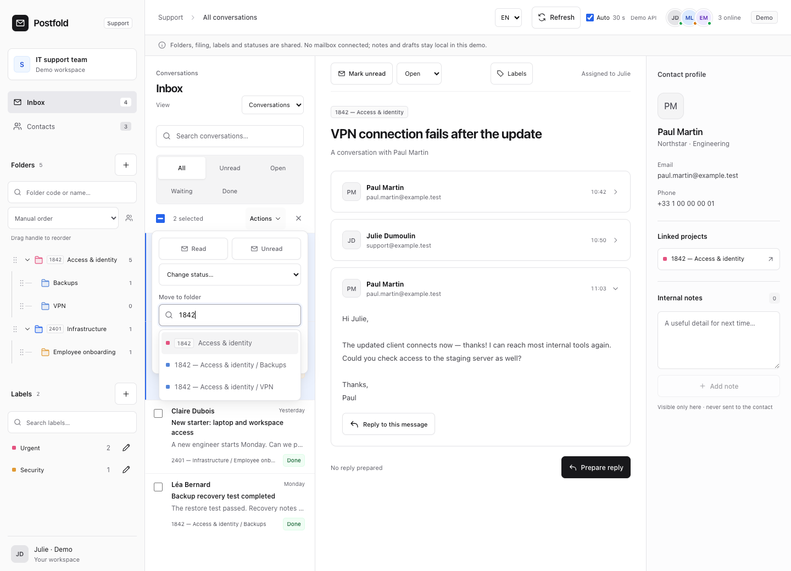

<details>
<summary>More screenshots: folder targeting, trees, labels, contacts, drafts and mobile</summary>

### Drag-and-drop folder targeting

Drag an unselected conversation immediately to move it alone, or drag a checked conversation to move the selected batch. The source rows stay in place and the destination folder is highlighted. This capture shows two conversations being dragged; filing changes are shared with the team.

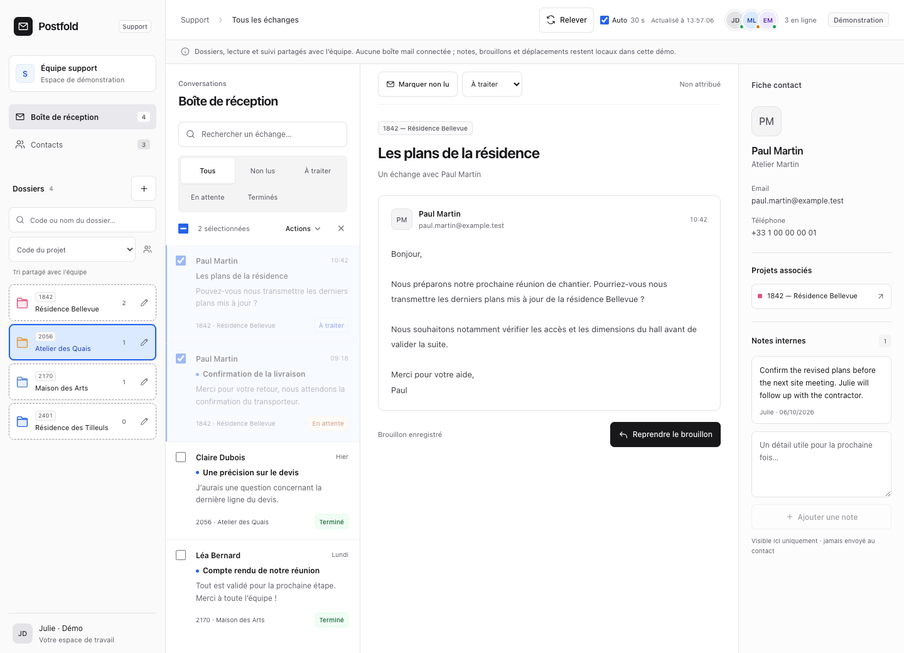

### Shared project folders

Create a folder or edit its name, color and position. Existing project codes cannot be changed. Add subfolders with a free name and choose their parent in the editor. Collapse a branch to hide its descendants. Empty folders without children can be deleted; populated folders are protected. Folder names, colors, order and sorting are the same reference for every browser.

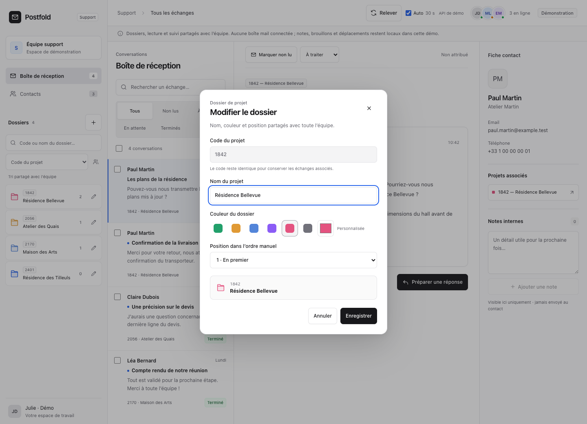

### Compact trees and manual ordering

Folder rows keep the code, name and descendant count on one line. Indentation and branch guides distinguish children. The full path is available on hover. Edit controls appear on hover or keyboard focus; touch layouts keep them visible.

In manual sort mode, drag a grip above or below a sibling to reorder it. Drop in the center to make it a child. Children move with their parent, and invalid cycles or depths beyond eight levels are rejected. Arrow keys reorder siblings; the editor offers parent and position selectors.

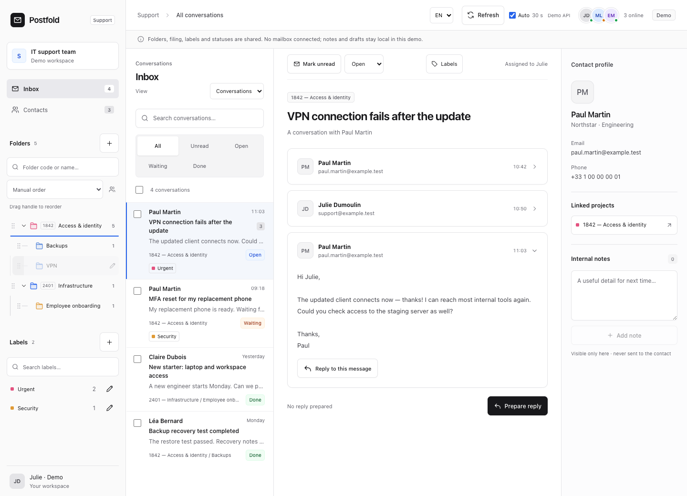

### Messages or conversation threads

Choose **All messages** to list each email separately, with direct reply controls. Choose **Conversations** to group messages by explicit thread ID, show the latest preview and activity, and expand individual messages in the reader. Matching subjects alone never merge unrelated messages.

Display mode and list/thread ordering are saved independently in this browser. Both orders default to newest first; choose oldest first to read chronologically. Switching views or order preserves the current draft. Message actions affect one message in All messages mode; thread actions affect every message in that thread, including messages outside the current folder or search filter. Opening a thread marks its messages read. Drafts remain associated with the message being answered.

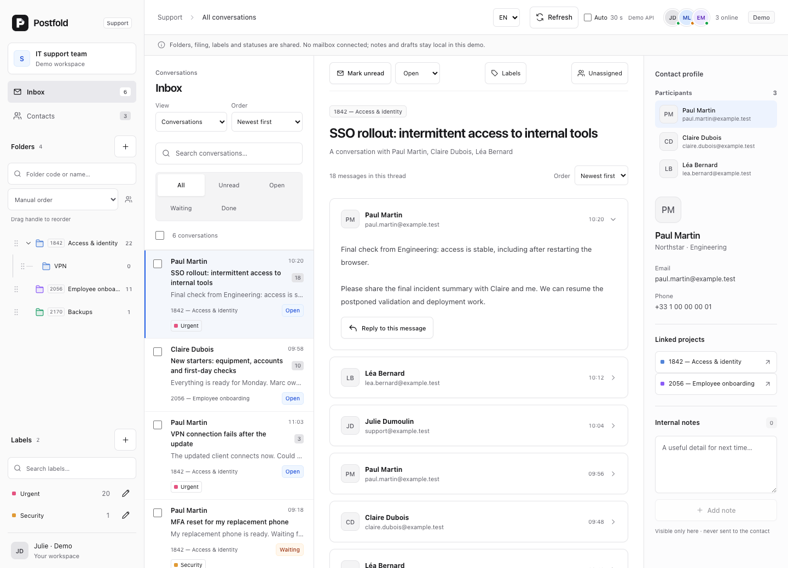

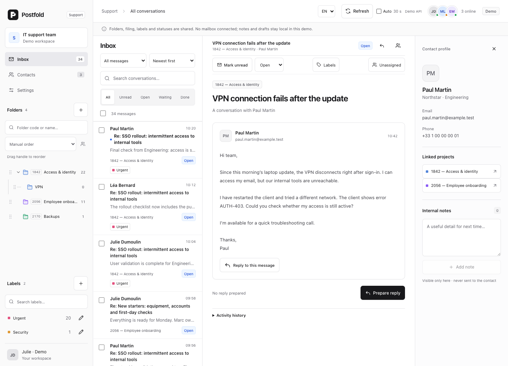

### Shared labels

Use the sidebar to create or edit a label and click it to filter conversations. Open Labels in the reader or batch actions to add or remove assignments. A partly assigned batch shows a mixed checkbox; other labels remain intact.

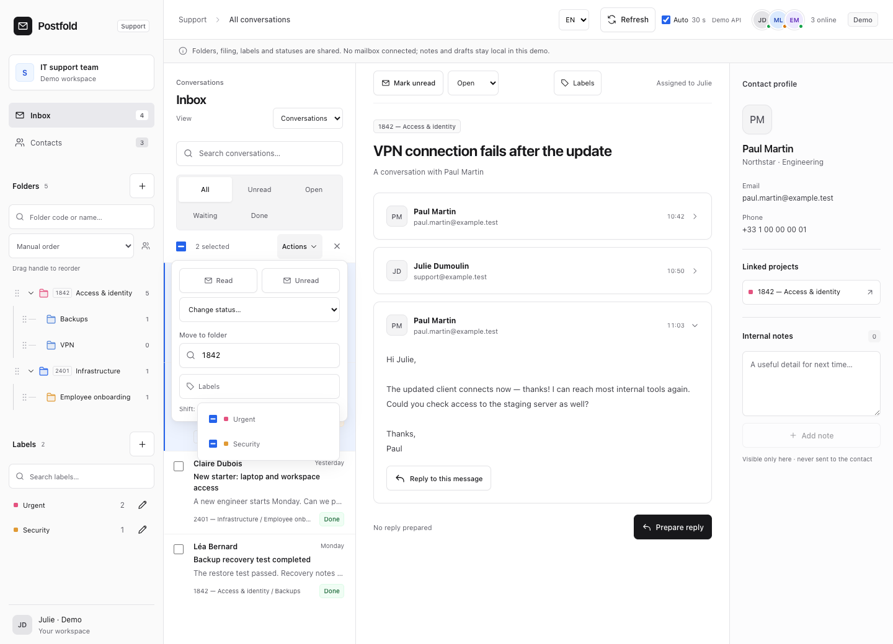

### Contacts and notes

Keep contact details, related projects and conversation history together. Multi-contact threads show each participant and let you choose their profile; note drafts and saved notes remain attached to that contact. Choosing a profile does not change the reply recipient. New IMAP imports include visible From, To, Cc and Reply-To participants, excluding the shared mailbox and Bcc. Previously cached messages still expose their known contact; full recipient lists become available on newly imported messages. Notes shown here are stored in the current browser, not shared with teammates yet.

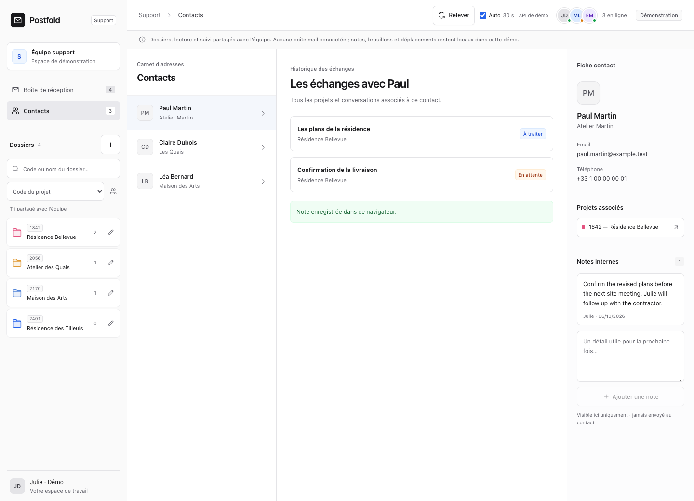

### Draft composer

Write rich replies with formatting, lists, links, tables, template insertion and an assigned signature. Expand the editor for a dedicated writing viewport with fixed controls, including on mobile. Show or collapse the signature preview and inspect the complete HTML before sending. Switching modes preserves editor history. Attach files by selection, drag-and-drop or clipboard paste; attachments survive reloads in IndexedDB. Text and formatting are autosaved locally, with Save draft and Send available together. Send remains disabled in the fictional demo. [Writing and team management](authoring.md) covers permissions and limits.

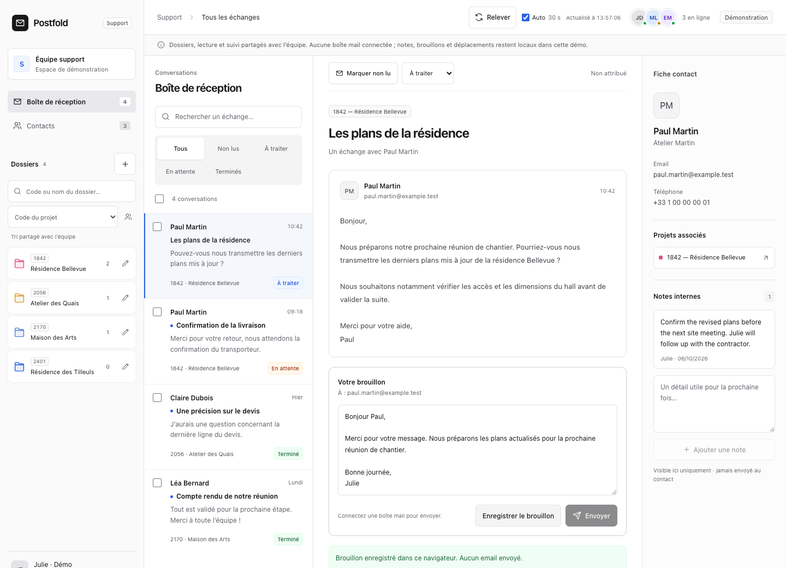

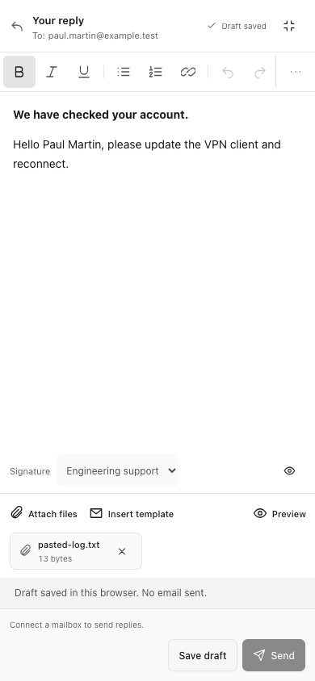

### Templates, signatures and team management

Open **Settings** for personal and shared template CRUD, an HTML signature editor with sandboxed previews, and member access/role/signature management. Shared settings persist in PostgreSQL with revision checks; a conflict preserves the editor content.

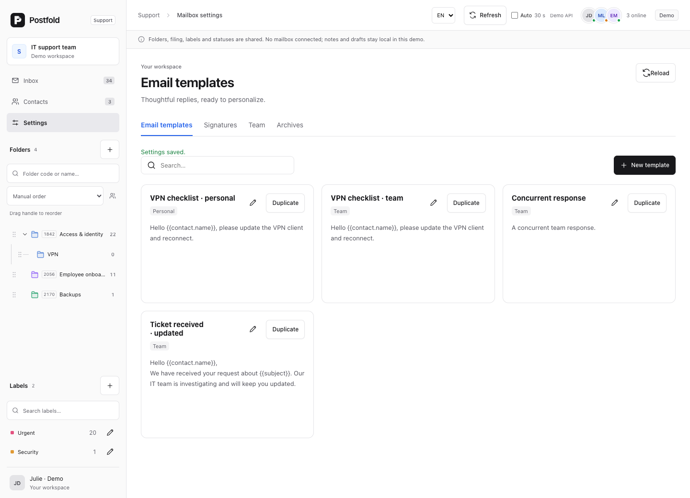

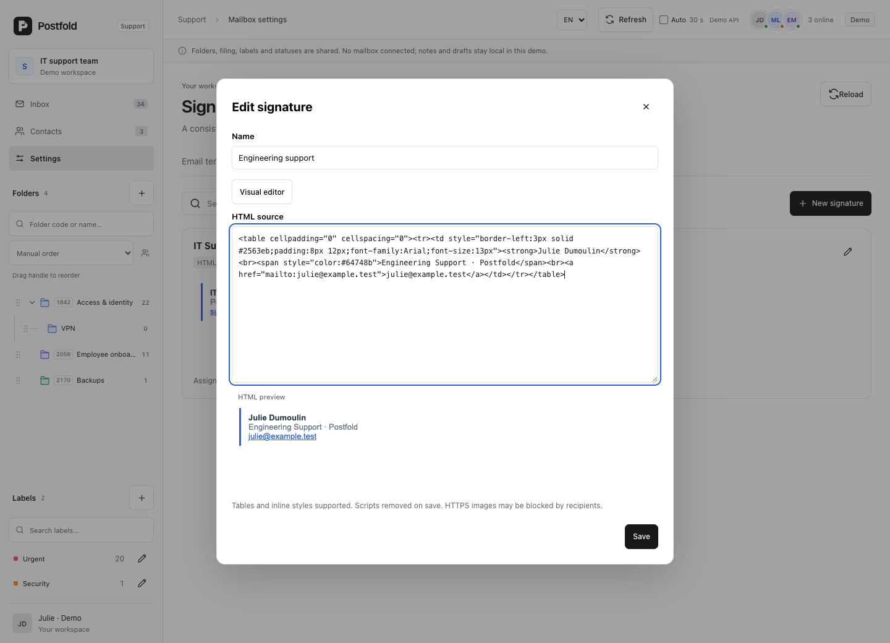

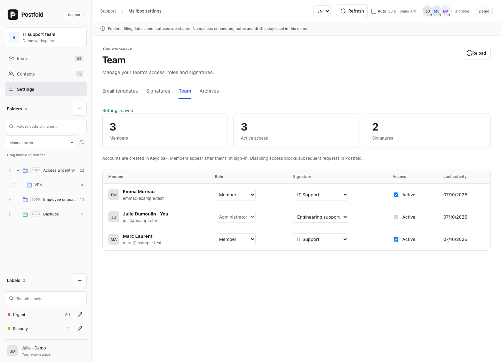

### Connected mailbox

Live mode imports native IMAP folders and messages and enables SMTP replies. Credentials are encrypted in PostgreSQL, with the encryption key kept separately on the server. This capture uses a real TLS-enabled test mail server with fictional IT support requests; see [mailbox setup](mailbox-setup.md) to connect your provider.

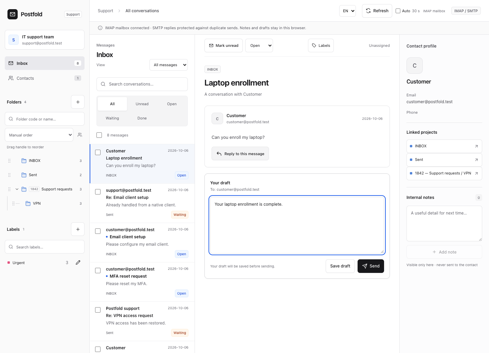

### Keycloak identity

Enable [Keycloak SSO](keycloak.md) to sign in individually and restrict mailbox access with a client role. The header shows the current user and a Sign out action; local drafts and notes are separated by user. This capture uses a real Keycloak login with fictional support data.

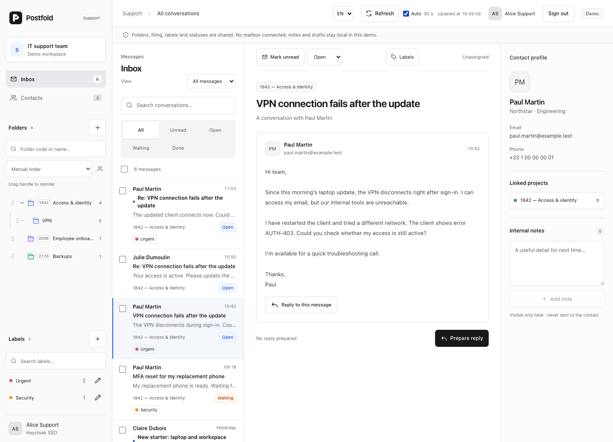

### Assignment and activity

Use the assignment control in the reader or batch actions to assign messages to yourself, search known teammates or remove assignments. Mixed batches show **Mixed assignment**. Keycloak teammates become available after opening this mailbox once; Postfold does not need Keycloak administration permissions. Default demo mode uses explicitly fictional teammates and Julie as its fictional action author.

Assignment changes use the same revisions as read flags, workflow states, filing and labels. A conflict cancels the whole batch, returns current states and requires an explicit retry. Assignment stays in PostgreSQL and does not modify IMAP messages. In live mode, new messages in an existing thread inherit the most recent message's assignment; existing assignments survive native moves and synchronization. All messages mode changes one message, while Conversations mode changes all currently known messages in that thread.

Open **Activity history** to see the latest 50 recorded state changes and SMTP send attempts for the displayed messages. Authors come from the verified API session. The journal captures actual before/after states in the same transaction; no-op or rejected writes create no entries. Send authors are persisted atomically with the send reservation before SMTP starts; the attempt shows sending, accepted or uncertain delivery without inventing a successful response. Duplicate retries reuse the original attempt and author.

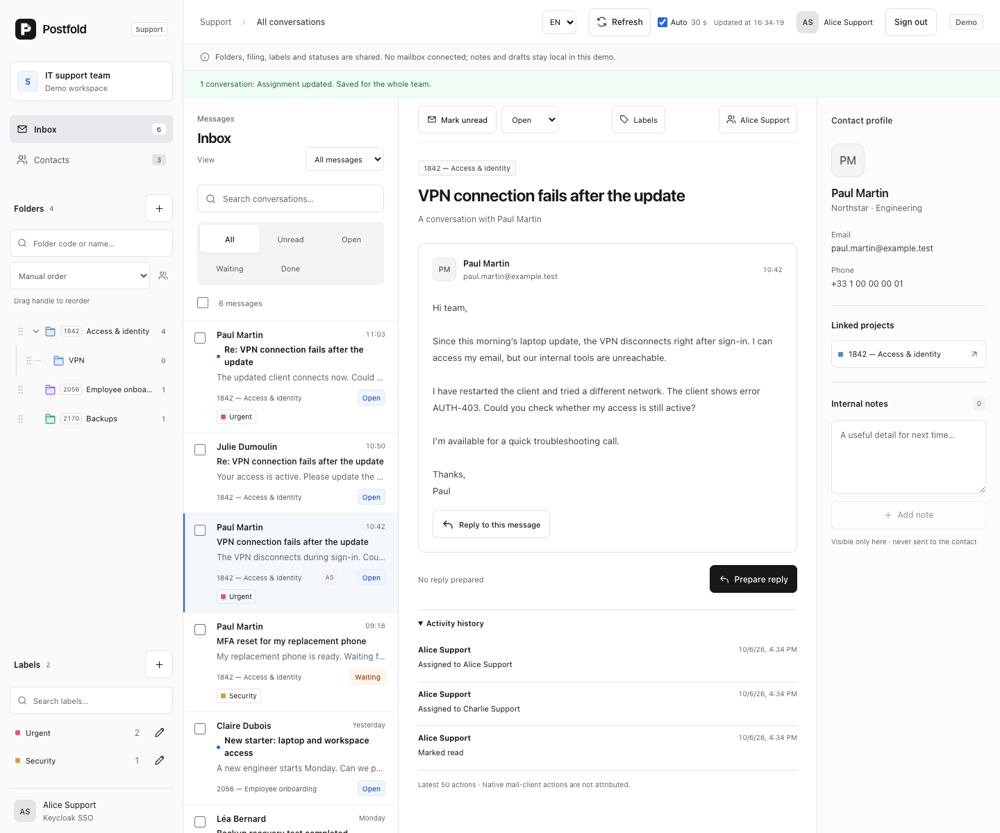

Shared Basic access has no individual identity and appears as **Shared access**. Native-client changes cannot be attributed to a Postfold user. Older actions are not reconstructed; folder-catalog edits, label-catalog cleanup, local notes and local drafts are not included in this journal. Updates appear on refresh, without WebSocket presence or writing reservations. Assignment is responsibility tracking, not a lock or an additional permission.

### Mobile inbox

The application fits the viewport. On desktop, mail rows, the reader, folders, labels and contact details scroll independently while the global header and list controls remain visible. In short desktop windows, list controls also scroll to keep rows reachable. Folder and label sections start collapsed on mobile. The list, reader and contact panel stack inside a scrollable content area below the fixed global header. Opening a message brings its reader into view; choosing Inbox or a folder returns to the list. Batch actions fit the available space without moving conversation rows.

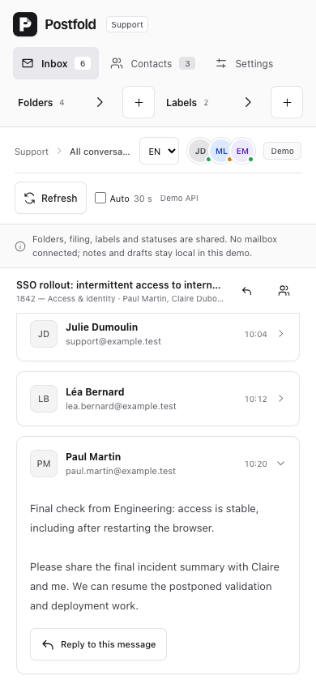

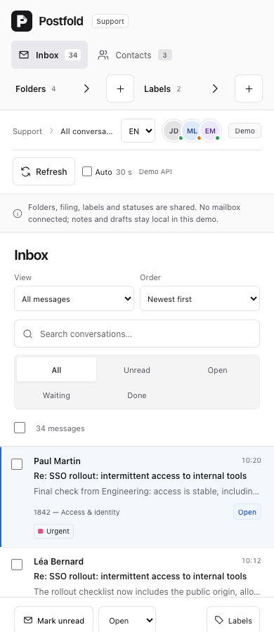

</details>

All screenshots come from the running application with fictional data. The connected-mailbox capture uses real IMAP/SMTP protocols against an isolated test server; the SSO capture uses a real Keycloak realm. Other captures show demo mode with simulated presence. See [docs/screenshots/README.md](screenshots/README.md) for capture details.

## Quick start

Requirements: Node.js 24 or later, pnpm 10, and Docker with Docker Compose.

```sh
pnpm install --frozen-lockfile
pnpm dev
```

Open [the interface](http://127.0.0.1:3002). The API health endpoint is [http://127.0.0.1:4000/health](http://127.0.0.1:4000/health).

`pnpm dev` starts PostgreSQL, compiles the API, and runs the frontend, API and API compiler watcher. The frontend uses port 3002 in strict mode. PostgreSQL listens only on `127.0.0.1:55432` and persists demo settings and states in the `mailer-postgres` Docker volume.

The credentials in `compose.yaml` and `.env.example` are for local development only. Do not expose this unauthenticated demo as an operational support application.

### Environment

The API reads its process environment; it does **not** automatically load `.env.example`. Export overrides before starting the relevant process.

| Variable | Default | Purpose |
| --- | --- | --- |
| `API_ORIGIN` | `http://127.0.0.1:4000` | API URL used by the TanStack Start server. |
| `API_HOST` | `127.0.0.1` | API bind address. |
| `API_PORT` | `4000` | API port. |
| `DEMO_MODE` | Disabled | Enables demo routes when exactly `true`. `pnpm dev:api` sets it explicitly. |
| `DATABASE_URL` | Local demo connection in `.env.example` | PostgreSQL connection used by the API and integration tests. |

Use a separate database when overriding `DATABASE_URL` for tests. API tests create and remove an isolated demo mailbox; they do not change the normal demo mailbox.

## Working with conversations

Opening a conversation marks it read, including the initially displayed conversation and openings from contact history. Selecting a checkbox only selects it. Marking the open conversation unread keeps it unread through refreshes until it is opened again. Reading a conversation does not close its support workflow.

Shared state updates check a revision per conversation. A conflicting batch is rejected as a whole, displays current shared states and can be reviewed before retrying. Older refresh responses cannot replace a newer acknowledged revision. Folder settings use a revision for the whole settings document; conflicts keep the entered values available for review.

Other browsers receive shared changes on manual refresh or the next automatic refresh, **not** through WebSockets. Refresh preserves drafts and selection unless the selected conversations stop matching the active filters.

| Interaction | Behavior |
| --- | --- |
| Checkbox | Select or deselect without opening or marking read. |
| Shift + checkbox/click | Select a range from the selection anchor. |
| Ctrl/Cmd + click | Toggle an item in the selection. |
| Ctrl/Cmd + A in the list | Select all visible conversations. |
| Escape in the list | Clear selection when no actions panel is handling Escape. |
| Destination picker arrows / Enter | Browse results and move the selection. |
| Folder grip drag / Up / Down | Reorder folders in manual mode with no folder search active. |
| Folder editor position | Reorder using a select control, including on mobile. |

Changing the search, conversation filter or project clears selection. A failed local draft save prevents navigation to another conversation to protect the entered text.

## Data ownership

| Data | Current storage | Shared across browsers? |
| --- | --- | --- |
| Folder tree, colors, order, sort and label catalog | PostgreSQL | Yes, on refresh. |
| Read/unread and workflow states | PostgreSQL | Yes, on refresh. |
| Messages and contacts | Demo fixtures, or IMAP/cache in live mode | Shared mailbox data; demo data is fictional. |
| Teammate directory, assignments and recorded activity | PostgreSQL | Yes, on refresh. Demo identities are fictional. |
| Conversation filing and label assignments | PostgreSQL | Yes, on refresh. |
| Personal/team templates, signatures and member access/roles | PostgreSQL | Yes. Personal templates are visible only to their owner. |
| Notes and rich draft text | Browser localStorage | No. |
| Draft attachments | Browser IndexedDB | No. |
| Interface language | URL search parameter | Per user; does not change shared names. |
| Message/thread display mode | Browser localStorage | Personal preference. |
| Presence avatars and activity labels | UI fixtures | Simulated. |

Local persistence is not an offline PWA. In live mode, IMAP is authoritative for folders, native moves and the `\Seen` flag; PostgreSQL caches messages and stores collaborative metadata, encrypted accounts and durable send attempts. Browser storage is scoped by mailbox email and, with Keycloak enabled, user ID. Existing demo localStorage keys and database/volume names are retained across the project rename. Old browser-local `placements` entries are ignored: the API provides filing state. Existing demo databases keep their settings; new demo databases receive the IT support fixtures. See [live-mode boundaries](mailbox-setup.md#current-boundaries-and-recovery) for protocol and recovery limits.

## Architecture

| Component | Responsibility |
| --- | --- |
| `src/` — TanStack Start + React | Interface, SSR, local interactions and server-side HTTP adapters to NestJS. |
| `api/` — NestJS | Mail endpoints, input validation, PostgreSQL writes, concurrency rules and Keycloak sessions/guards. |
| `shared/` | Shared contracts, validators, folder ordering and revision-aware state merging. |
| PostgreSQL | Authoritative shared folder settings and conversation tracking states. |
| `api/mail-store.ts` | IMAP polling, UID/UIDVALIDITY reconciliation, native folder/read/move operations, SMTP replies and durable send reservations. |

The intended boundary keeps messages and project folders in IMAP, with collaborative metadata stored separately. Native mail clients should remain usable. Application send reservations cannot prevent someone sending directly from a native client; reconciliation must account for that.

### Next milestones

- Extend IMAP synchronization with incremental MODSEQ, attachment handling and robust reconciliation of ambiguous native changes.
- Extend [Keycloak SSO](keycloak.md) with per-action roles and multi-mailbox permissions; individual sessions, client-role guards, shared assignments and action attribution are implemented.
- Add provider OAuth and key rotation; password-based IMAP/SMTP already uses authenticated encryption with keys outside PostgreSQL and certificate-validated TLS.
- Add WebSocket presence and editing reservations; extend the recorded action history and durable send coordination with operator recovery and follow-up replies.
- Move notes, drafts and contact management into shared storage with conflict handling.
- Add an offline PWA and evaluate TanStack DB and CRDTs for the parts that need concurrent editing.
- Add a plugin boundary and external API integrations, including meeting creation.
- Improve thread reconciliation for incomplete or duplicate Message-ID/References headers.

These milestones remain planned. Live mode already records durable send attempts and blocks duplicate or uncertain retries; presence indicators alone would be insufficient. An uncertain SMTP result never triggers an automatic blind resend.

## Development checks

```sh
pnpm typecheck
pnpm test
pnpm build
```

`pnpm test` starts the demo database, compiles the API and runs Node's built-in tests. Checks cover search, selection, filing, hierarchy, labels, locales, persistence, stale revisions, batch conflicts, personal template ownership, safe HTML signatures, member access and attachment validation. `pnpm test:authoring` builds and starts an isolated production demo to exercise the writing/settings UI, attachment persistence and responsive dialogs; it requires `agent-browser`.

With `pnpm dev` running and the `agent-browser` CLI installed:

```sh
pnpm test:drag
```

This browser regression check uses an isolated Chromium session and real mouse gestures. It verifies first-drag filing, batch counts, cancellation, nested Escape handling and stable list positions on desktop and mobile. It temporarily changes shared demo filing, then restores it only if its revision still owns the change. Use it with the local fictional demo.

To run compiled output, start PostgreSQL with `pnpm db:up`, then run these commands in separate terminals:

```sh
# Terminal 1: demo API; demo routes are otherwise disabled by default.
DEMO_MODE=true pnpm start:api

# Terminal 2: compiled frontend with an explicit local address and port.
NITRO_HOST=127.0.0.1 NITRO_PORT=3002 pnpm start
```

For environment files, HTTPS, services, backups and updates, follow [self-hosting](self-hosting.md). For a real account, also follow [mailbox setup](mailbox-setup.md).

## Contributing and license

See [CONTRIBUTING.md](../CONTRIBUTING.md) for the workflow and English Conventional Commit format.

Postfold is licensed under **AGPL-3.0-only**. See [LICENSE](../LICENSE).
